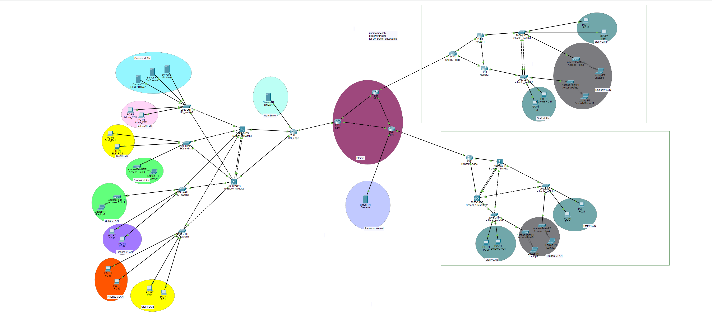
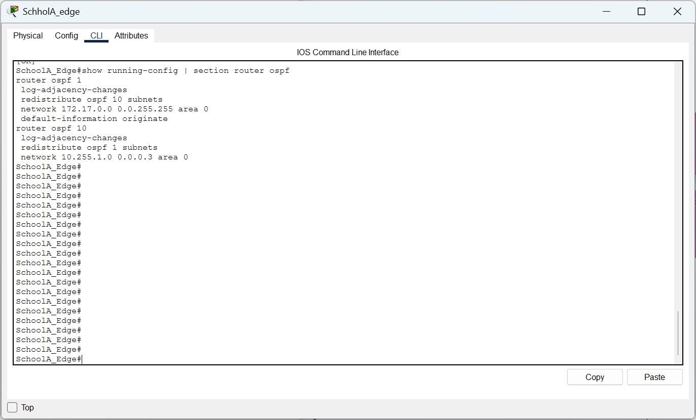
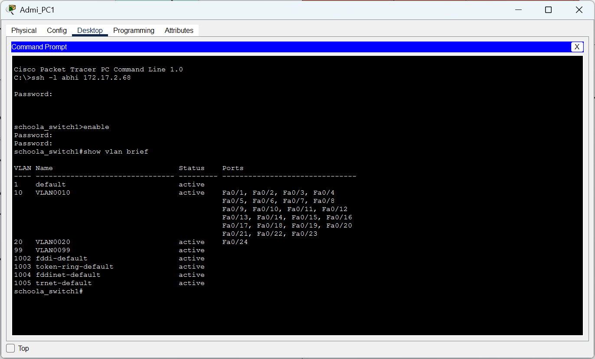
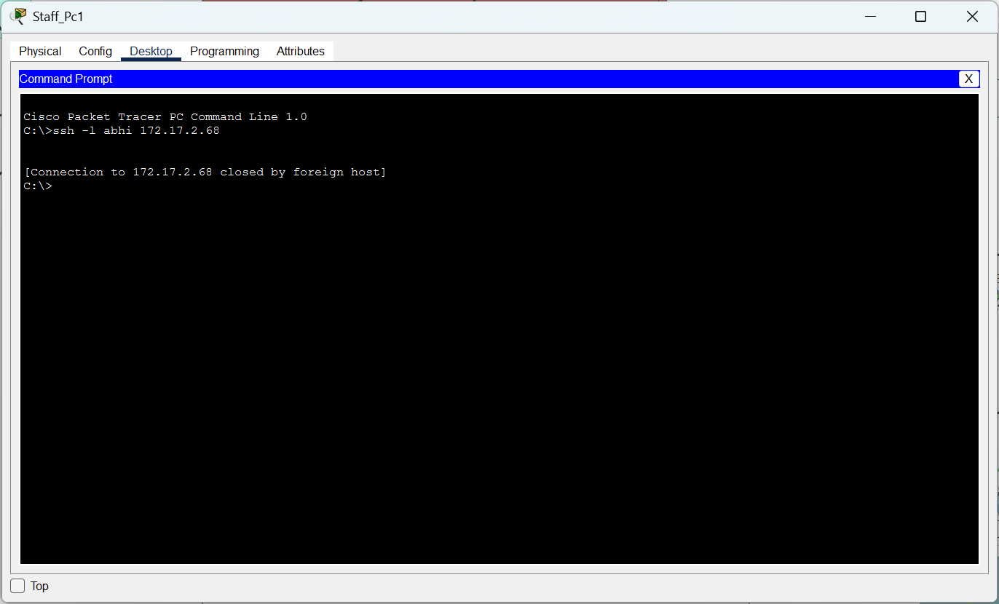
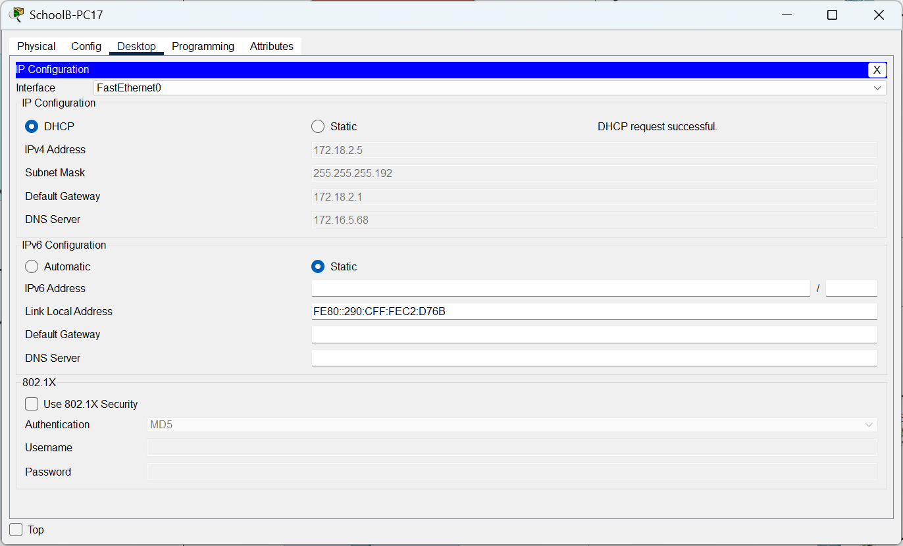
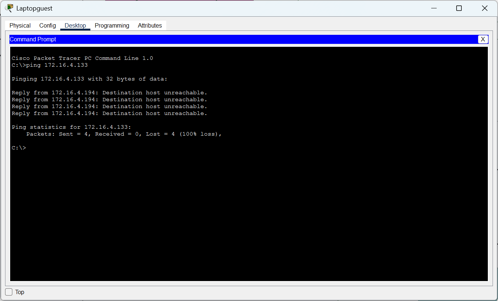
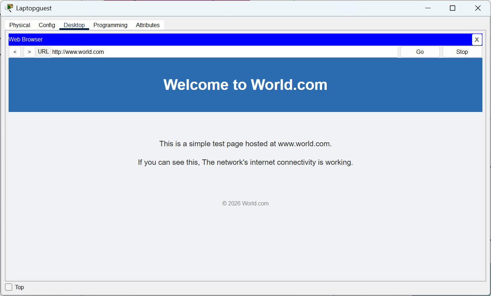
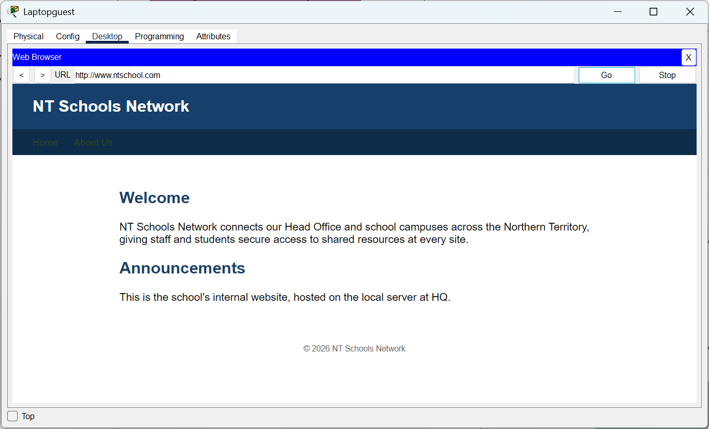
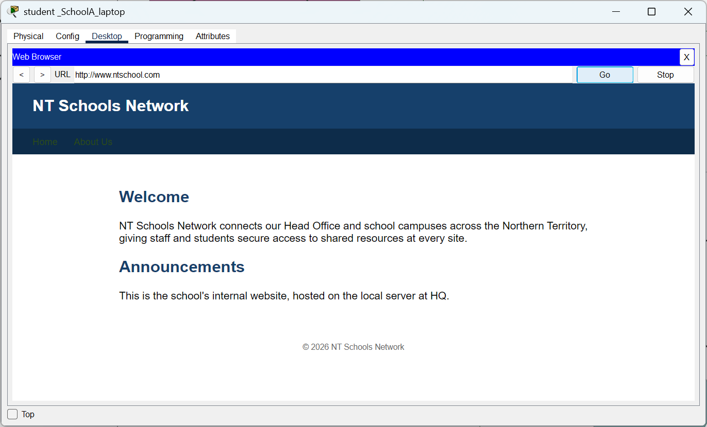
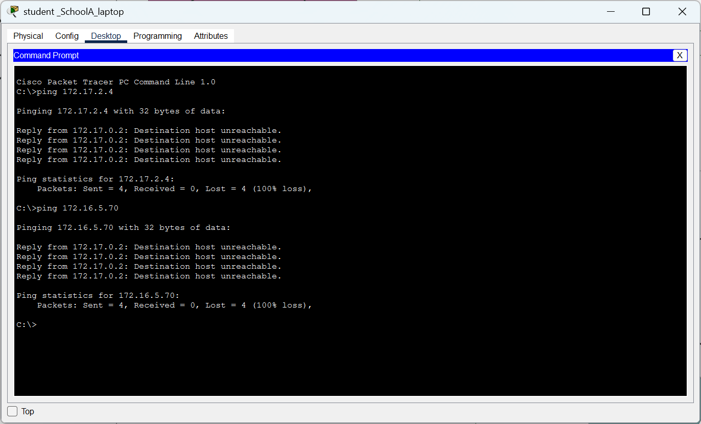

# NT Schools Network - Multi-Site WAN (GRE over IPsec)

## Background

NT Schools Network Authority operates a Head Office plus two remote school
campuses across the Northern Territory. The sites need to share internal
resources (staff systems, servers, department data) securely, but leased
lines between campuses are too costly to justify. Instead, each site
connects to the public internet through its own ISP link, and a GRE-over-
IPsec site-to-site VPN is used to give the three sites private, encrypted
connectivity across that public network - while each site still uses its
own connection for normal internet access.

In this project many networking concept like HSRP,VLAN,STP,OSPF,Etherchannel,NAT are used but 
the project is made to show the knowledge regarding site to site VPN and Secure remote
login. So, those networking topic will be discussed more.

## Objectives

This project demonstrates:

- Multi-site WAN design over a simulated public internet (3-router ISP core)
- GRE tunneling for inter-site connectivity that supports dynamic routing
- IPsec (ISAKMP/IKE + ESP) to encrypt and authenticate the GRE tunnels
- A clean separation between underlay routing (ISP reachability) and
  overlay routing (inter-site LAN reachability, carried only over the tunnels)
- NAT/PAT so internet-bound traffic is translated while inter-site traffic
  is explicitly exempted and travels the encrypted tunnel instead
- VLAN segmentation and inter-VLAN routing (multiple department VLANs at
  HQ; Staff/Student VLANs at each school)
- Router- and switch-based DHCP and DNS
- Extended/named ACLs for inter-VLAN and inter-site traffic control
- Device hardening: SSH-only management, local AAA, port security
- Redundancy: EtherChannel between distribution switches, multiple
  routers/links at branch sites, a meshed 3-router ISP core

## Topology

**Shared ISP Core** - three routers meshed together in the middle,
simulating the public internet. They run their own routing (OSPF) purely
to reach each site's public IP; they have no visibility into any site's
internal VLANs or address space.

**Head Office (HQ)** - a two-tier switched design: two Layer 3 distribution
switches interconnected (EtherChannel) for resiliency, four access
switches dual-homed into the distribution pair, and one edge router
providing the GRE/IPsec/NAT gateway out to the ISP core. Hosts multiple
department VLANs (Admin, HR, Finance/IT, Servers, Guest, etc.).

**School Campus A** - three routers for internal path redundancy plus two
access switches linked by EtherChannel; one router is the WAN edge running
GRE/IPsec back to HQ. Two VLANs (Management, Staff, Students).

**School Campus B** - one WAN edge router plus a small two-tier switch
block (two distribution switches + two access switches); GRE/IPsec tunnel
back to HQ. Three VLANs (Management, Staff, Students).

## IP addressing plan

### HQ - 172.16.0.0/16

- VLAN 20 - Students - 1019 hosts - 172.16.0.0/22 - usable 172.16.0.1 to 172.16.3.254 (Active switch= Switch1)
- VLAN 10 - IT/Staff - 123 hosts - 172.16.4.0/25 - usable 172.16.4.1 to 172.16.4.126 (Active switch =Switch2)
- VLAN 30 - Admin/Management - 59 hosts - 172.16.4.128/26 - usable 172.16.4.129 to 172.16.4.190 (Active switch=switch2)
- VLAN 60 - Guest/Wi-Fi - 50 hosts - 172.16.4.192/26 - usable 172.16.4.193 to 172.16.4.254 (Active switch= switch1)
- VLAN 40 - HR - 20 hosts - 172.16.5.0/27 - usable 172.16.5.1 to 172.16.5.30 (Active switch= switch2)
- VLAN 50 - Finance - 27 hosts - 172.16.5.32/27 - usable 172.16.5.33 to 172.16.5.62 (Active switch= switch2)
- VLAN 70 - Servers - 10 hosts - 172.16.5.64/28 - usable 172.16.5.65 to 172.16.5.78 (Active switch= switch2)
- VLAN 99 - Mgmt/Native - 10 hosts - 172.16.5.80/28 - usable 172.16.5.81 to 172.16.5.94 (active switch= switch2)

- HQ_edge- Switch1 = 172.16.5.96/30
- HQ_edge - switch2 = 172.16.5.100/30

- Webserver network (vlan 80) - 172.16.5.104/30
- two switch layer 3 connection (vlan 91)=172.16.5.108/30
- Loopback0 IP for edge router= 172.16.6.1/32

### School-A - 172.17.0.0/17

- VLAN 20 - Students - 507 hosts - 172.17.0.0/23 - usable 172.17.0.1 to 172.17.1.254
- VLAN 10 - Staff - 59 hosts - 172.17.2.0/26 - usable 172.17.2.1 to 172.17.2.62
- VLAN 99 - Mgmt/Native - 10 hosts - 172.17.2.64/28 - usable 172.17.2.65 to 172.17.2.78

edge_router - switch1=
 172.17.2.80/30
edge_router - switch 2=172.17.2.84/30
Loopback0 IP address for SchoolA_edge router= 172.17.3.1/32

### School-B - 172.18.0.0/16

- VLAN 20 - Students - 507 hosts - 172.18.0.0/23 - usable 172.18.0.1 to 172.18.1.254
- VLAN 10 - Staff - 59 hosts - 172.18.2.0/26 - usable 172.18.2.1 to 172.18.2.62
- VLAN 99 - Mgmt/Native - 10 hosts - 172.18.2.64/28 - usable 172.18.2.65 to 172.18.2.78
Edge-router - router 1=172.18.2.80/30
Edge_router - router 2=172.18.2.84/30
roouter1 - router 2= 172.18.2.88/30
Loopback0 IP address for SchoolB_edge router= 172.18.3.1/32
Loopback0 IP address for SchoolB_Router1= 172.18.3.2/32
Loopback0 IP address for SchoolB_Router2= 172.18.3.3/32
### Overlay Tunnel Addressing (GRE, hub-and-spoke)

- HQ to School-A - 10.255.1.0/30 - HQ 10.255.1.1 - School-A 10.255.1.2
- HQ to School-B - 10.255.2.0/30 - HQ 10.255.2.1 - School-B 10.255.2.2

### Public WAN Addressing (ISP block 200.100.10.0/27)

- HQ to ISP-1 - 200.100.10.24/29 - HQ 200.100.10.25 - ISP-1 200.100.10.26
- School-A to ISP-2 - 200.100.10.4/30 - School-A 200.100.10.5 - ISP-2 200.100.10.6
- School-B to ISP-3 - 200.100.10.8/30 - School-B 200.100.10.9 - ISP-3 200.100.10.10
- ISP-1 to ISP-2 - 200.100.10.12/30 - ISP-1 200.100.10.13 - ISP-2 200.100.10.14
- ISP-2 to ISP-3 - 200.100.10.16/30 - ISP-2 200.100.10.17 - ISP-3 200.100.10.18
- ISP-1 to ISP-3 - 200.100.10.20/30 - ISP-1 200.100.10.21 - ISP-3 200.100.10.22

## GRE over IPsec Implementation

### Summary

Each school (School-A, School-B) has a GRE tunnel back to HQ. HQ has one tunnel per school. IPsec protects each tunnel by encrypting the traffic that passes through it. The encryption is applied on each router's WAN-facing interface (the one facing the ISP), not on the tunnel interface itself.

### Settings Used

- Encryption: AES-256
- Hashing: SHA-1
- Authentication: Pre-shared key (a different key for each site pair)
- DH Group: 5
- Only GRE traffic between the two tunnel endpoints gets encrypted - nothing else on the WAN interface is affected

### Notes on Packet Tracer Limitations

The plan was to use SHA-256 and DH Group 14 (stronger, more modern settings), but this router's IOS image only supports SHA-1 and DH Group 5 for this part of the configuration, so those were used instead.

The plan was also to use IPsec transport mode (slightly more efficient since GRE already adds its own IP header), but this Packet Tracer version does not let me set that option. It falls back to the IOS default, tunnel mode, instead. This still works correctly and still encrypts everything - it just adds a small amount of extra overhead per packet.

Each router also needed its security license enabled before any encryption commands would work, using `license boot module c2900 technology-package securityk9` followed by a reload.

## SSH
The devices on all school LAN can be configured through ssh from admin PC using following ip address.
### HQ LAN
HQ_edge router = 172.16.6.1
Multilayer Switch 1=  172.16.5.83
Multilayer Switch 2= 172.16.5.82
HQ_Switch1= 172.16.5.84
HQ_Switch2= 172.16.5.85
HQ_Switch3= 172.16.5.86
HQ_Switch4= 172.16.5.87

### School A
SchoolA_edge router=  172.17.3.1
SchoolA_Mswitch1= 172.17.2.67
SchoolA_Mswitch2=  172.17.2.66
schoola_switch1= 172.17.2.68
schoola_switch2= 172.17.2.69

### SchoolB
schoolB_edge router= 172.18.3.1
schoolB_Router1= 172.18.3.2
schoolB_Router2= 172.18.3.3
schoolB_switch1= 172.18.2.68
schoolB_switch2= 172.18.2.69

## Student/Guest Network Access Restriction

Student devices (at all three sites) and Guest/Wi-Fi devices (at HQ) are
limited to internet browsing and access to the shared DNS, DHCP, and
internal web server. They cannot reach any staff, admin, HR, finance, or
server resources, and cannot reach any other site's internal network.
This keeps student and guest traffic isolated from all sensitive internal
systems while still giving them normal internet and basic network
services.

## Additional Notes

**Overlay routing:** Two OSPF processes per site - `ospf 1` (LAN-facing)
and `ospf 10` (owns tunnels, forms the inter-site adjacency) - mutually
redistributed (`redistribute ospf 10 subnets` under `ospf 1` and vice
versa) so tunnel-learned routes reach local LAN devices, not just the
edge router.

**NAT:** PAT overload for internet traffic; a NAT-exemption ACL denies
translation for inter-site LAN traffic (so it stays real and routes over
the encrypted tunnel) and permits everything else.

**Hardening:** enable secret and  SSH-only VTY (RSA keys,
Telnet disabled), VTY access restricted to the admin VLAN via
`access-class`.

**Loopbacks:** each edge router (and School B's internal routers) uses a
`/32` Loopback0 as a stable SSH/management target, independent of any
physical interface state.

**Lesson learned:** Mismatched OSPF wildcard masks between the two
processes on a router can leave a subnet covered by only one process; a
switch left as an L2 switchport (or missing global `ip routing`) will
silently break L3 forwarding to its downstream VLANs even with correct
SVIs.

## Some images for verification of project success

### Topology

### OSPF
Two ospf process are used. 1 for underlay and 10 for overlay.

### SSH

### Access to webserver and DHCP server

